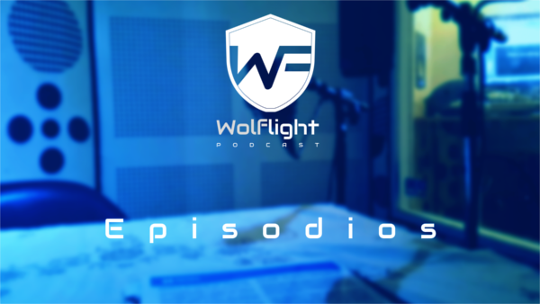

Puedes escucharnos acá:  
[Anchor](https://anchor.fm/wolflightpodcast)  [iTunes](https://itunes.apple.com/us/podcast/wolflight/id1346042033)  [Play Music](https://playmusic.app.goo.gl/?ibi=com.google.PlayMusic&isi=691797987&ius=googleplaymusic&apn=com.google.android.music&link=https://play.google.com/music/m/Iu4tadjpbygpinsi4rcpybkfvne?t%3DWolflight%26p)  [Pocket Casts](http://pca.st/4p2e)  [Stitcher](http://stitcher.com/s?fid=169556&refid=stpr)  [RadioPublic](https://play.radiopublic.com/wolflight-WonJMO)  

| Episodio | |Acerca de|    
|---|---|---|    
| [E0 - TestFlight 030218](https://anchor.fm/wolflightpodcast/episodes/Wolflight-E01---TestFlight-e12c33)|<code> |</code>| [Hablamos de](./_posts/2018-2-6-E01-TestFlight.md) |  
| [E1 - ¿Crypto monedas de qué? 160218](https://anchor.fm/wolflightpodcast/episodes/E1-1-Crypto-monedas-de-qu-e12o27) |<code> |</code>| [Hablamos de](./_posts/2018-2-16-E1.1-Crypto-monedas-de-que.md) |  
| [E2 - Mapas y no-tuiters 240218](https://anchor.fm/wolflightpodcast/episodes/Wolflight-E2---Mapas-y-no-tuiters-e13gtl) |<code> |</code> |[Hablamos de](./_posts/2018-2-24-E2-Mapas-y-no-tuiters.md) |  

